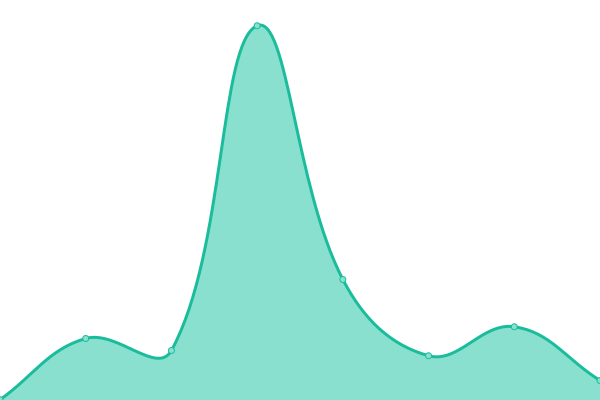
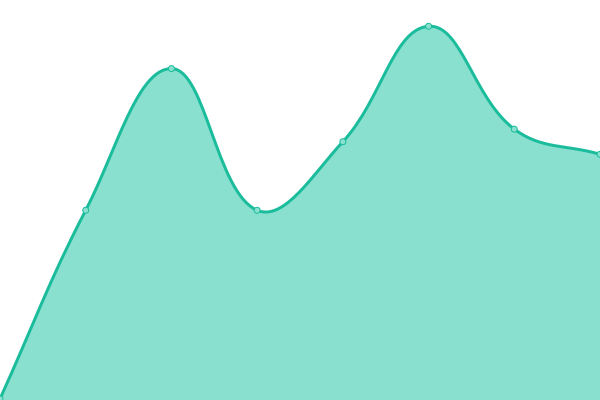
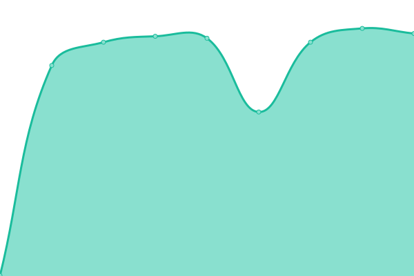

# [📈 Live Status](https://status.swiftwave.org): <!--live status--> **🟧 Partial outage**

This repository contains the open-source uptime monitor and status page for [Upptime](https://upptime.js.org), powered by [Upptime](https://github.com/upptime/upptime).

<!--start: status pages-->
<!-- This summary is generated by Upptime (https://github.com/upptime/upptime) -->
<!-- Do not edit this manually, your changes will be overwritten -->
<!-- prettier-ignore -->
| URL | Status | History | Response Time | Uptime |
| --- | ------ | ------- | ------------- | ------ |
|  [Landing Page & Documentation](swiftwave.org) | 🟩 Up | [landing-page-and-documentation.yml](https://github.com/swiftwave-org/upptime/commits/HEAD/history/landing-page-and-documentation.yml) | 

 259ms
     
 | 

<a href="https://status.swiftwave.org/history/landing-page-and-documentation">100.00%</a>
    

|  [API Documentation](https://apidocs.swiftwave.org) | 🟥 Down | [api-documentation.yml](https://github.com/swiftwave-org/upptime/commits/HEAD/history/api-documentation.yml) | 

 228ms
     
 | 

<a href="https://status.swiftwave.org/history/api-documentation">0.00%</a>
    

|  [Staging Environment](http://staging.swiftwave.org:3333/.well-known/pre-authorize) | 🟥 Down | [staging-environment.yml](https://github.com/swiftwave-org/upptime/commits/HEAD/history/staging-environment.yml) | 

 0ms
     
 | 

<a href="https://status.swiftwave.org/history/staging-environment">0.00%</a>
    

<!--end: status pages-->

## 📄 License

- Powered by: [Upptime](https://github.com/upptime/upptime)
- Code: [MIT](./LICENSE) © [Upptime](https://upptime.js.org)
