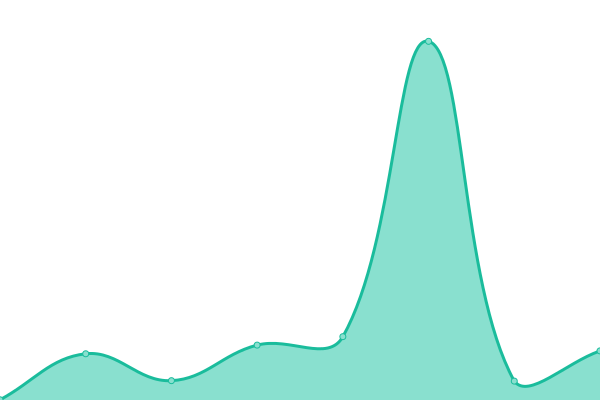

# [📈 Live Status](https://status.swiftwave.org): <!--live status--> **🟩 All systems operational**

This repository contains the open-source uptime monitor and status page for [Upptime](https://upptime.js.org), powered by [Upptime](https://github.com/upptime/upptime).

<!--start: status pages-->
<!-- This summary is generated by Upptime (https://github.com/upptime/upptime) -->
<!-- Do not edit this manually, your changes will be overwritten -->
<!-- prettier-ignore -->
| URL | Status | History | Response Time | Uptime |
| --- | ------ | ------- | ------------- | ------ |
|  [Landing Page & Documentation](swiftwave.org) | 🟩 Up | [landing-page-and-documentation.yml](https://github.com/swiftwave-org/upptime/commits/HEAD/history/landing-page-and-documentation.yml) | 

 226ms
     
 | 

<a href="https://status.swiftwave.org/history/landing-page-and-documentation">100.00%</a>
    

|  [Swiftwave Dashboard](dashboard.swiftwave.org) | 🟩 Up | [swiftwave-dashboard.yml](https://github.com/swiftwave-org/upptime/commits/HEAD/history/swiftwave-dashboard.yml) | 

 200ms
     
 | 

<a href="https://status.swiftwave.org/history/swiftwave-dashboard">100.00%</a>
    

|  [API Documentation](https://apidocs.swiftwave.org) | 🟩 Up | [api-documentation.yml](https://github.com/swiftwave-org/upptime/commits/HEAD/history/api-documentation.yml) | 

 204ms
     
 | 

<a href="https://status.swiftwave.org/history/api-documentation">100.00%</a>
    

|  [Secured Proxy](https://proxy.swiftwave.org/status) | 🟩 Up | [secured-proxy.yml](https://github.com/swiftwave-org/upptime/commits/HEAD/history/secured-proxy.yml) | 

 811ms
     
 | 

<a href="https://status.swiftwave.org/history/secured-proxy">100.00%</a>
    

|  [Staging Environment](http://staging.swiftwave.org/stats) | 🟩 Up | [staging-environment.yml](https://github.com/swiftwave-org/upptime/commits/HEAD/history/staging-environment.yml) | 

 742ms
     
 | 

<a href="https://status.swiftwave.org/history/staging-environment">100.00%</a>
    

<!--end: status pages-->

## 📄 License

- Powered by: [Upptime](https://github.com/upptime/upptime)
- Code: [MIT](./LICENSE) © [Upptime](https://upptime.js.org)
